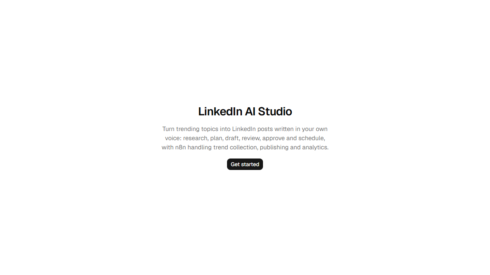
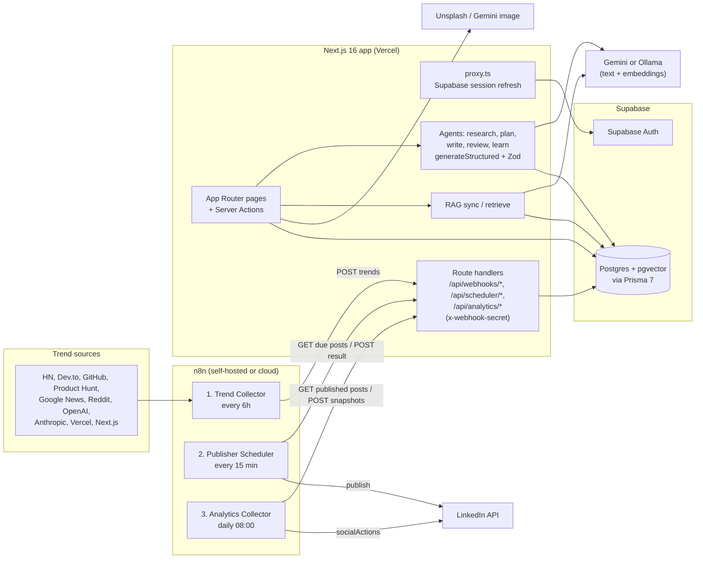
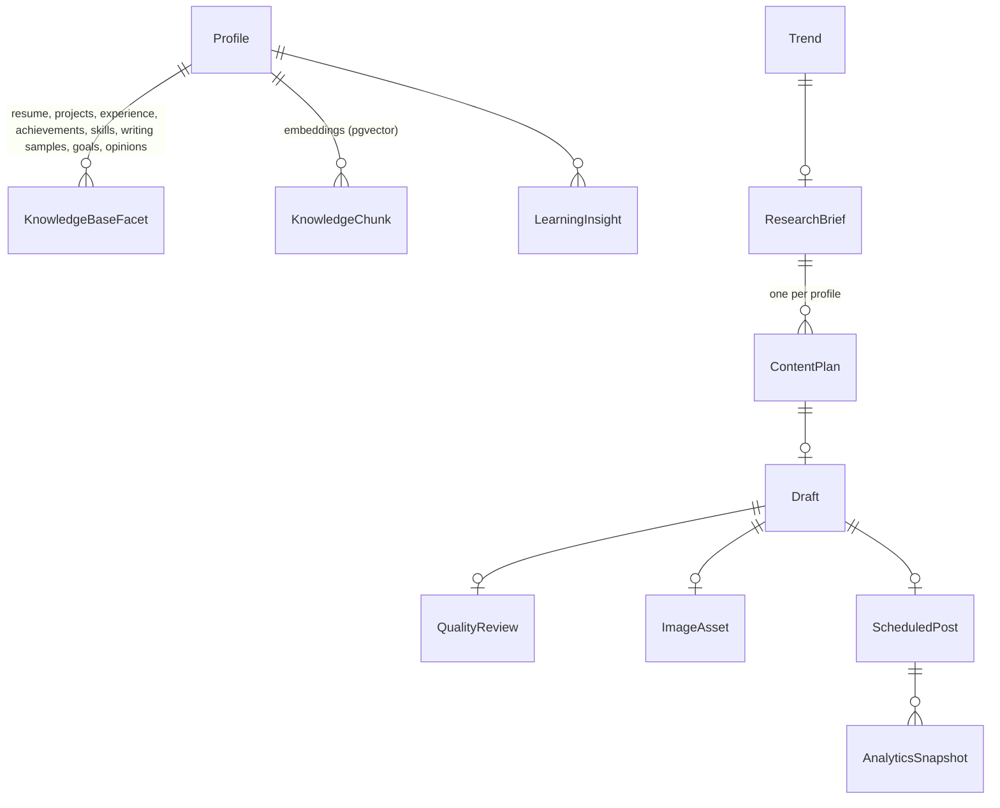

# LinkedIn AI Studio

A personal content pipeline that turns trending tech topics into LinkedIn posts written in your own voice: n8n collects trends, a chain of LLM agents researches, plans, drafts and critiques each post using a RAG-backed personal knowledge base, and you approve and schedule. n8n then publishes to LinkedIn and pulls engagement back in.

[](https://github.com/Sami123d/linkedin-ai-studio/actions/workflows/ci.yml)


**Live deployment:** https://linkedin-ai-studio-alpha.vercel.app shows the landing, login and register pages. Every app page is behind Supabase Auth, and the pipeline only does something once the AI keys, Knowledge Base and n8n workflows are set up (see [Getting started](#getting-started)).



## Status

The whole pipeline is written: milestones 0 to 15 plus the three n8n workflows are in the git history. It is a single-developer project and has **not** been proven end-to-end against LinkedIn:

| Area | State |
|---|---|
| Auth, Knowledge Base, RAG, all agents, approval/calendar UI, webhook API | Implemented |
| n8n Trend Collector | Implemented; the workflow doc says its sources were checked against their live endpoints |
| n8n Publisher Scheduler | Implemented with n8n's LinkedIn node. Not verified against a real LinkedIn app. Carousels are published as a numbered text post |
| n8n Analytics Collector | Implemented. Likes and comments only: LinkedIn's standard API does not expose impressions or shares, so engagement rate stays empty |
| Gemini image generation | Scaffold only (needs a billed Gemini account). Unsplash search is the default image source |
| Automated tests | Unit tests for validation, webhook auth, structured LLM output and the trends webhook. No DB or end-to-end tests yet |

## Features

- **Auth**: Supabase email/password sign-up and login. Session cookies are refreshed in `proxy.ts`, and the `(app)` layout redirects signed-out users to `/login`.
- **Knowledge Base** (`/knowledge-base`): CRUD for resume, projects, experience, achievements, skills, writing samples, goals and opinions, all scoped to the signed-in profile.
- **RAG sync**: embeds Knowledge Base entries into a `knowledge_chunks` table (pgvector, 768 dimensions) and retrieves them by cosine similarity for the planning and writing agents.
- **Trends** (`/trends`): trends arrive from n8n through a webhook protected by a shared secret. You mark them reviewed or dismissed.
- **Agent pipeline**, one page per stage. Every run is stored with status, provider/model and an attempt log (prompt, raw response, error):
  1. **Research**: a brief with summary, insights, opportunities, risks and content angles.
  2. **Planning**: picks a format (single post, carousel or article), an angle and key message, using the goals and RAG context.
  3. **Writing**: drafts the post and hashtags from your writing samples and RAG context.
  4. **Quality review**: scores hook, clarity, voice match, value and CTA (0 to 100) and gives a verdict and feedback. The overall score is computed in code.
  5. **Images**: Unsplash search for the draft, or Gemini image generation.
- **Approval and calendar** (`/approval`, `/calendar`): approve a draft with a publish time, then see it on a month calendar with its published or failed state.
- **Analytics and learning** (`/analytics`, `/learning`): engagement snapshots per post, and an LLM "learning insight" that summarises what worked across your measured posts. It is shown to you and is not fed back into the agents automatically.
- **Pluggable providers**: `AI_PROVIDER=gemini|ollama` switches text generation and embeddings, and `IMAGE_PROVIDER=unsplash|gemini` switches images. Agents only depend on the `AIProvider` interface, and all JSON output goes through one Zod-validated `generateStructured()` helper.

## Architecture



### Auth and request flow

- **`proxy.ts`** (Next.js 16's replacement for `middleware.ts`) runs `updateSession()` from `src/lib/supabase/proxy.ts` on every non-static request. It refreshes the Supabase session cookie, copies Supabase's cache headers onto the response so a CDN can't serve one user's cookie to another, redirects signed-out users away from `/dashboard` and `/profile`, and sends signed-in users from `/login` and `/register` to `/dashboard`.
- **`src/app/(app)/layout.tsx`** checks `getClaims()` and redirects to `/login` for every page in the app, so pages outside the proxy's list are protected too.
- **Server actions** call `requireProfileId()` and scope every Prisma query by the user's id. Prisma connects as a privileged role that bypasses RLS, so this check in the app is the real authorization boundary. RLS is enabled with no policies as defense in depth.
- **n8n endpoints** have no session. Each checks its own shared secret (`TREND_`, `SCHEDULER_`, `ANALYTICS_WEBHOOK_SECRET`) with a constant-time comparison (`src/lib/webhook-auth.ts`).
- `GET /api/scheduler/due` claims posts with a single `UPDATE ... FOR UPDATE SKIP LOCKED`, so overlapping n8n runs can't publish the same post twice. A claim that is never confirmed becomes claimable again after 15 minutes.

### Data model (Prisma, `prisma/schema.prisma`)



- `Profile.id` equals the Supabase `auth.users` id. It is inserted by a Postgres trigger defined in the first migration, never by app code.
- Each AI stage (research, plan, draft, review, image, learning) has a status enum and a `*Attempt` audit table.
- `Trend` and `ResearchBrief` are shared. Everything from `ContentPlan` onward belongs to a profile.
- Engagement rate is derived from the stored counts (`computeEngagementRate`) and never stored.
- Raw SQL migrations in `prisma/migrations/` add the pgvector extension and index, the resume storage bucket, the signup trigger and RLS.

### n8n workflows (`n8n/workflows/`)

Every workflow reads `APP_BASE_URL` from the n8n environment and sends its secret through an n8n Header Auth credential, so the exported JSON contains no secrets. Each workflow has a detailed `.md` next to its `.json`.

| Workflow | Trigger | What it does | Key nodes |
|---|---|---|---|
| **01 Trend Collector** (34 nodes) | Cron `0 */6 * * *` | Pulls from 10 sources in parallel branches, normalizes them to one shape, merges, deduplicates, scores, puts each item in one of 6 categories, drops items older than 14 days, keeps the top 30 and POSTs them to `/api/webhooks/trends` | HTTP Request (HN Algolia, Dev.to, GitHub search, Product Hunt GraphQL, Reddit RSS), RSS Feed Read (Google News, OpenAI, Anthropic via Google News, Vercel, Next.js), Code (normalize, dedupe, score, categorize, rank), Merge, IF |
| **02 Publisher Scheduler** (9 nodes) | Cron `*/15 * * * *` | `GET /api/scheduler/due` claims the approved posts that are due. For each one it builds the post text (carousel slides are joined into a numbered list), publishes with or without an image, and POSTs success or failure to `/api/scheduler/publish` | HTTP Request, Code, IF (has image?), LinkedIn node (OAuth2) |
| **03 Analytics Collector** (10 nodes) | Cron `0 8 * * *` | `GET /api/analytics/published-posts`, gets the LinkedIn post URN, calls `GET /v2/socialActions/{urn}` for likes and comments, and POSTs the batch to `/api/webhooks/analytics`. Failed lookups are left out rather than sent as zeros | HTTP Request (LinkedIn OAuth2), Code, IF |

Fetch and POST nodes use `retryOnFail` (3 tries, 5 s apart). A failing source or post doesn't stop the rest of the run.

### Free hosting without n8n: GitHub Actions trend collector

`scripts/collect-trends.ts` is a dependency-free port of the Trend Collector: same 10 sources, scoring, categories, 14-day filter and top-30 cap. `.github/workflows/trend-collector.yml` runs it every 6 hours on GitHub Actions, so the deployed app gets trends with no n8n server to host. The regular trend inserts should also help keep a free Supabase project active, since Supabase pauses free projects after a week without database activity.

Setup, in the repository's **Settings → Secrets and variables → Actions**:

- Secret `TREND_WEBHOOK_SECRET`: the same value as in Vercel.
- Variable `APP_BASE_URL`: the deployed app URL, e.g. `https://linkedin-ai-studio-alpha.vercel.app`.
- Optional secret `PRODUCT_HUNT_TOKEN` to enable the Product Hunt source.

Then run it once from the **Actions** tab (**Trend Collector → Run workflow**). To try it locally without sending anything: `node --experimental-strip-types scripts/collect-trends.ts --dry-run` (Node 22). GitHub turns off scheduled workflows after 60 days without commits to the repo; re-enable it from the Actions tab if that happens.

## Tech stack

- **Framework**: Next.js 16 (App Router, Server Actions, `proxy.ts`), React 19, TypeScript
- **UI**: Tailwind CSS 4, shadcn/ui (Base UI), lucide-react, next-themes (dark mode), react-hook-form
- **Data**: PostgreSQL on Supabase, Prisma 7 with the `@prisma/adapter-pg` driver adapter, pgvector
- **Auth and storage**: Supabase Auth (`@supabase/ssr`), a Supabase Storage bucket for resumes
- **AI**: Google Gemini (`@google/genai`) or Ollama for text and embeddings, Unsplash API for images
- **Validation**: Zod 4 (env, forms, webhook payloads, LLM output)
- **Automation**: n8n
- **Tooling**: ESLint, Prettier, Vitest, GitHub Actions

## Project structure

```
proxy.ts                 Supabase session refresh and route guards
prisma/                  schema.prisma and SQL migrations (pgvector, trigger, RLS)
n8n/                     exported workflows (.json) with design docs (.md)
src/app/(auth)/          login, register
src/app/(app)/           dashboard, knowledge-base, trends, research, planning,
                         writing, review, images, approval, calendar, analytics,
                         learning, profile
src/app/api/             n8n-facing route handlers (secret-protected)
src/ai/                  providers (gemini, ollama, unsplash) and agent prompt/generation code
src/features/            server actions per feature, RAG sync and retrieval
src/validation/          Zod schemas
src/config/              env validation (client and server)
tests/                   Vitest unit tests
```

## Getting started

Requirements: Node 20+, a Supabase project (Postgres with the `vector` extension available), a Gemini API key (or a local Ollama), and an n8n instance if you want the automation. [ONBOARDING.md](ONBOARDING.md) has the full first-time walkthrough, including LinkedIn and n8n credentials.

```bash
git clone https://github.com/Sami123d/linkedin-ai-studio.git
cd linkedin-ai-studio
cp .env.example .env        # fill in the values (DIRECT_URL is needed by the postinstall prisma generate)
npm ci
npx prisma migrate deploy   # applies schema, pgvector, the signup trigger, RLS
npm run dev                 # http://localhost:3000
```

Then register at `/register`, fill in the Knowledge Base, run **RAG Sync**, import the three workflows from `n8n/workflows/` into n8n and set `APP_BASE_URL` there.

## Environment variables

All are validated at startup by Zod in `src/config/env.server.ts` and `src/config/env.client.ts`.

| Variable | Required | Purpose |
|---|---|---|
| `DATABASE_URL` | yes | Pooled Supabase Postgres connection (port 6543) used by Prisma Client at runtime |
| `DIRECT_URL` | yes | Direct connection used by the Prisma CLI (migrate, generate, studio) |
| `NEXT_PUBLIC_SUPABASE_URL` | yes | Supabase project URL |
| `NEXT_PUBLIC_SUPABASE_PUBLISHABLE_KEY` | yes | Supabase publishable (anon) key |
| `NEXT_PUBLIC_SITE_URL` | yes | App origin used in email-confirmation redirect links |
| `TREND_WEBHOOK_SECRET` | yes (16+ chars) | Shared secret for `POST /api/webhooks/trends` |
| `SCHEDULER_WEBHOOK_SECRET` | yes (16+ chars) | Shared secret for `/api/scheduler/due` and `/api/scheduler/publish` |
| `ANALYTICS_WEBHOOK_SECRET` | yes (16+ chars) | Shared secret for `/api/analytics/published-posts` and `/api/webhooks/analytics` |
| `AI_PROVIDER` | no (`gemini`) | `gemini` or `ollama`, used for text generation and embeddings |
| `GEMINI_API_KEY` | for Gemini | Gemini API key |
| `GEMINI_MODEL` | no (`gemini-2.5-flash`) | Text model |
| `GEMINI_EMBEDDING_MODEL` | no (`gemini-embedding-001`) | Embedding model. Must output 768 dimensions to match the `vector(768)` column |
| `OLLAMA_BASE_URL` / `OLLAMA_MODEL` | for Ollama | Local Ollama endpoint and model |
| `IMAGE_PROVIDER` | no (`unsplash`) | `unsplash` (search) or `gemini` (generation, needs billing) |
| `UNSPLASH_ACCESS_KEY` | for Unsplash | Unsplash API access key |

n8n side: `APP_BASE_URL`, plus Header Auth credentials for the three secrets, a LinkedIn OAuth2 credential, and an optional Product Hunt token.

## Testing

```bash
npm run lint
npm run typecheck
npm test          # Vitest
```

The suite in `tests/` covers the Zod schemas for the n8n webhook payloads and LLM review output, the constant-time webhook secret check, the engagement-rate calculation, `generateStructured()` with a fake provider (JSON mode, invalid JSON, wrong shape), and the `POST /api/webhooks/trends` handler with Prisma mocked (401 / 400 / 201 / empty batch). CI (`.github/workflows/ci.yml`) runs lint, typecheck, tests and a production build on every push, using placeholder env values.

## Deployment

- **App**: Vercel. Pushes to `master` deploy to production. Set every variable from the table above in Vercel, and set `NEXT_PUBLIC_SITE_URL` to the production origin.
- **Database**: run `npx prisma migrate deploy` against Supabase whenever new migrations land.
- **n8n**: import the three JSON files, create the credentials, set `APP_BASE_URL` to the deployed URL, and activate the workflows. The checklist is in [ONBOARDING.md, section 7](ONBOARDING.md).

## Roadmap

- [ ] Verify publishing end-to-end against a real LinkedIn developer app (the Publisher Scheduler's LinkedIn node output fields are still unconfirmed)
- [ ] Real multi-image carousels through LinkedIn's Posts API (currently a numbered text post)
- [ ] Impressions and shares (needs LinkedIn Marketing API partner access)
- [ ] Feed learning insights back into the planning and writing prompts
- [ ] Fill the dashboard's "Today's draft" and "Upcoming schedule" cards with real data (they are placeholders)
- [ ] Surface repeated publish failures in the UI (`publish_attempts` is already tracked)
- [ ] Integration tests against a real Postgres with pgvector
