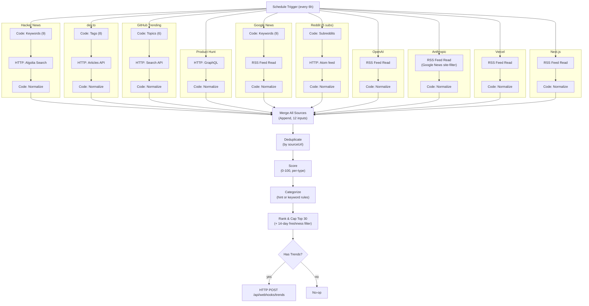

# Workflow 1: Trend Collector (multi-source)

Runs on a schedule, collects candidate trends from **10 sources**, normalizes
them into one schema, deduplicates, scores, categorizes, ranks the best 30,
and sends them to `POST /api/webhooks/trends`.

Import file: [`01-trend-collector.json`](./01-trend-collector.json)

Every endpoint used below was **verified live** (real HTTP requests, checked
during this design) rather than assumed from memory — see the per-source
notes for what was actually confirmed and what wasn't.

## Architecture



## The "add a source later" design

Every source branch does exactly one job — **fetch raw data, normalize it
into the shared intermediate shape below** — and feeds into one numbered
input of a single **Merge All Sources** node. Everything downstream
(Deduplicate → Score → Categorize → Rank) operates on the shared shape only
and has no source-specific logic.

**Shared intermediate shape** (what every Normalize node outputs, before the
app's actual webhook shape is built in the final Rank step):

```ts
{
  topic: string,
  summary: string,
  sourceName: string,
  sourceUrl: string,
  rawScore: number | null,       // native popularity metric (points/stars/reactions/votes), or null
  rawScoreType: "log" | "editorial" | "unranked",
  publishedAt: string | null,    // ISO date, or null
  hintCategory: string | null    // one of the 6 target categories, or null to let Categorize infer it
}
```

**To add source #11:** add one fetch node + one Normalize Code node
producing this shape, then wire its output into input `10` or `11` on the
**Merge All Sources** node (already provisioned with 12 inputs — 10 used, 2
spare). Only once all spares are used does the Merge node itself need a
one-field edit (`Number of Inputs`). Nothing else changes: not the
Deduplicate/Score/Categorize/Rank logic, not the webhook POST, not the app.

## Sources — what's real vs. what needs a credential

| Source | Endpoint | Auth needed? | Live-verified? |
|---|---|---|---|
| Hacker News | `hn.algolia.com/api/v1/search_by_date` | No | ✅ Yes |
| dev.to | `dev.to/api/articles?tag=...` | No | ✅ Yes (incl. all 8 tags used) |
| GitHub Trending | `api.github.com/search/repositories` (official Search API — GitHub has no public "trending" API, this is the legitimate substitute; see note below) | No (rate-limited harder without a token) | ✅ Yes (incl. all 6 topics used) |
| Product Hunt | `api.producthunt.com/v2/api/graphql` | **Yes — Bearer developer token** | ⚠️ Confirmed the endpoint exists and correctly demands auth (401 without a token); the GraphQL query shape itself is built from Product Hunt's stable, long-published v2 schema, not tested with a real token |
| Google News RSS | `news.google.com/rss/search?q=...` | No | ✅ Yes |
| Reddit | `reddit.com/r/{sub}/top/.rss?t=day` (Atom) | No (needs a custom `User-Agent` header) | ✅ Yes — but see the Reddit note below, this took two attempts |
| OpenAI News | `openai.com/news/rss.xml` | No | ✅ Yes |
| Anthropic News | *(no direct RSS exists — see note)* | No | ✅ Yes, via a Google News site-filter substitute |
| Vercel Blog | `vercel.com/atom` | No | ✅ Yes |
| Next.js Blog | `nextjs.org/feed.xml` | No | ✅ Yes |

### Notes on the two sources that weren't straightforward

**GitHub Trending has no official API.** `github.com/trending` is a
server-rendered HTML page with no REST/GraphQL equivalent; scraping it is
fragile (no stability guarantee, against GitHub's spirit even if not
strictly disallowed). The official **Search API**
(`search/repositories?q=topic:X+created:>DATE&sort=stars`) is a legitimate,
stable substitute — "recently created, sorted by stars" is a very close
proxy for "trending" and is what many trending-repo tools actually use
under the hood. Unauthenticated rate limit is 10 requests/minute; this
workflow uses 6 (one per topic) per run, well within that, but see
Production Recommendations if you shorten the schedule.

**Reddit's JSON API (`/r/x/top.json`) returned `403` in testing, even with
a custom `User-Agent` header** — likely blocking datacenter/automation IPs
outright. The **legacy Atom endpoint** (`/r/x/top/.rss?...`) worked fine.
Trade-off: Atom feeds don't carry Reddit's upvote count, so Reddit items
get `rawScoreType: "unranked"` (flat baseline score) rather than a real
popularity number — Production Recommendations covers the OAuth API
upgrade path if you want real Reddit scores later.

**Anthropic has no public RSS feed** — `/news/rss.xml` and other guessed
paths all 404'd. Substituted with a **Google News RSS search scoped to
`site:anthropic.com/news`**, confirmed working and returning real, current
Anthropic announcements. Same reusable trick works for any site without its
own feed.

## Required credentials

| Credential name | Type | Used by | Purpose |
|---|---|---|---|
| `Trend Webhook Secret` | Header Auth | POST Trends to App | `x-webhook-secret` header — same as Workflow 1's original design |
| `Product Hunt Bearer Token` | Header Auth | ProductHunt: GraphQL | `Authorization` header, value `Bearer <your PH developer token>` |

**Setup — Trend Webhook Secret:** unchanged from before — Header Auth
credential, header name `x-webhook-secret`, value = this app's
`TREND_WEBHOOK_SECRET`.

**Setup — Product Hunt Bearer Token:**
1. Go to [api.producthunt.com/v2/docs](https://api.producthunt.com/v2/docs), sign in, create an application (free).
2. Generate a **Developer Token** (long-lived, no OAuth redirect flow needed for read-only use).
3. In n8n: **Credentials → New → Header Auth** → Header Auth Name = `Authorization`, Value = `Bearer <token>`.
4. Save as `Product Hunt Bearer Token`, attach it to the **ProductHunt: GraphQL** node.

If you'd rather skip Product Hunt for now: disconnect its two nodes from
**Merge All Sources** (leave that input slot empty) — everything else keeps
working unchanged.

## Environment variables (n8n side)

Same as before: `APP_BASE_URL` in n8n's instance environment variables
(e.g. `http://localhost:3000` locally, your real domain in production).

## Nodes (34 total)

Grouped by branch — see the Architecture diagram for the shape.

| Branch | Fetch node | Normalize node | Notes |
|---|---|---|---|
| Hacker News | `HN: Search Hacker News` | `HN: Normalize` | 9 keyword searches; `rawScoreType: "log"` on HN points |
| dev.to | `DevTo: Search` | `DevTo: Normalize` | 8 tag queries; dev.to returns a bare JSON array, so n8n auto-splits it — Normalize uses `pairedItem` (not index math) to recover which tag produced each article |
| GitHub Trending | `GitHub: Search` | `GitHub: Normalize` | 6 topic searches, `created:>60 days ago` filter computed fresh each run |
| Product Hunt | `ProductHunt: GraphQL` | `ProductHunt: Normalize` | Single call, today's top 20 by ranking; category inferred from PH's own topic tags |
| Google News | `GNews: RSS` | `GNews: Normalize` | 9 keyword searches via RSS Feed Read (uses `pairedItem`, same reasoning as dev.to — one feed request can yield many parsed items) |
| Reddit | `Reddit: RSS` | `Reddit: Normalize` | 5 fixed subreddits; raw-text HTTP response, regex-parsed (see Reddit note above) |
| OpenAI News | `OpenAI: RSS` | `OpenAI: Normalize` | Fixed feed, `hintCategory: "AI"`, `rawScoreType: "editorial"` |
| Anthropic News | `Anthropic: RSS` | `Anthropic: Normalize` | Fixed feed (Google News substitute), same treatment as OpenAI |
| Vercel Blog | `Vercel: RSS` | `Vercel: Normalize` | Fixed feed, `hintCategory: "Web Development"` |
| Next.js Blog | `NextJS: RSS` | `NextJS: Normalize` | Fixed feed, same treatment as Vercel |

**Shared pipeline** (after all 10 branches converge):

| Node | Purpose |
|---|---|
| `Merge All Sources` | Append mode, 12 inputs (10 used, 2 spare) — concatenates every branch's normalized items into one list |
| `Deduplicate` | Groups by lowercased `sourceUrl`; when the same URL appears from two branches (e.g. an HN post that's also a GitHub repo), keeps whichever copy has the higher `rawScore` |
| `Score` | Maps `rawScore`/`rawScoreType` onto a common 0-100 scale: `log10(raw+1) * 30` (clamped) for popularity-metric sources, flat `70` for `editorial` (official blogs — inherently relevant regardless of external "points"), flat `50` for `unranked` (Google News, Reddit — no popularity number available) |
| `Categorize` | Uses `hintCategory` when a branch already knows it confidently (Reddit's subreddit, OpenAI/Anthropic/Vercel/Next.js's fixed identity); otherwise keyword-matches `topic + summary` against the 6 categories, falling back to `"Other"` |
| `Rank & Cap Top 30` | Drops anything with a parseable `publishedAt` older than 14 days, sorts by `score` descending, keeps the top 30, and shapes the final payload to exactly match `trendPayloadSchema` (`topic, summary, sourceName, sourceUrl, category, score, publishedAt`) |
| `Has Trends?` | Skips the POST entirely if the ranked list is empty |
| `POST Trends to App` | Sends the array as-is; app inserts via `createMany` |
| `No New Trends` | Dead-end marker for the empty-result branch |

## Payload shape sent to the app

Now includes `category` (added to `Trend`/`trendPayloadSchema` alongside this workflow):

```json
{
  "topic": "octocat/agentic-workflow-toolkit: A toolkit for building multi-agent systems",
  "summary": "A toolkit for building multi-agent systems",
  "sourceName": "GitHub Trending",
  "sourceUrl": "https://github.com/octocat/agentic-workflow-toolkit",
  "category": "AI Agents",
  "score": 89,
  "publishedAt": "2026-08-01T10:15:00.000Z"
}
```

## Testing instructions

1. **Import** `01-trend-collector.json` into n8n.
2. **Attach both credentials** (Trend Webhook Secret on the final POST node, Product Hunt Bearer Token on `ProductHunt: GraphQL`) — or disconnect the Product Hunt branch if you don't have a token yet.
3. **Set `APP_BASE_URL`** in n8n's environment.
4. **Test each branch independently first** (right-click a branch's fetch node → Execute Node) before running the whole workflow — with 10 external sources, isolating a failure to one branch is much faster than debugging the full graph:
   - Confirm each Normalize node outputs items matching the shared shape (topic/summary/sourceName/sourceUrl/rawScore/rawScoreType/publishedAt/hintCategory).
   - Pay particular attention to `DevTo: Normalize` and `GNews: Normalize` — open one output item and confirm `hintCategory` is populated (not `null`) for at least some items, which proves the `pairedItem` lookup is correctly wired to the right upstream item.
5. **Run the full workflow** (manual trigger or "Execute Workflow"):
   - Confirm `Merge All Sources` outputs items from multiple `sourceName` values, not just one.
   - Confirm `Deduplicate`'s output count is ≤ the merge count.
   - Confirm `Categorize`'s output items all have a non-null `category` (including `"Other"` where nothing matched).
   - Confirm `Rank & Cap Top 30` outputs `count` ≤ 30 and `trends` sorted by descending score.
   - Confirm `POST Trends to App` returns `{"inserted": N}` / HTTP 201.
6. **Verify in the app**: `/trends` shows the new entries with visible category badges.
7. **Re-test the auth failure paths**: wrong `Trend Webhook Secret` → 401 on the final POST; wrong/missing Product Hunt token → 401 on that branch specifically (shouldn't block the other 9 sources, since `onError: continueRegularOutput` is set on every fetch node).

## Error handling

- **Per-branch failures don't abort the run.** Every fetch node (HTTP Request and RSS Feed Read) is set to `onError: continueRegularOutput` — if e.g. GitHub's API is briefly down, that branch just contributes zero items; the other 9 branches and the shared pipeline continue normally.
- **Defensive parsing everywhere.** Every Normalize node guards against missing/malformed fields (`|| []`, `|| null`, optional chaining-equivalents) so an unexpected response shape from any one source degrades to "no results from that source," not a crashed workflow.
- **Malformed webhook payloads are rejected loudly, not silently.** If `Rank & Cap Top 30`'s output somehow doesn't match `trendPayloadSchema` (e.g. a future source normalization bug), the app's `POST /api/webhooks/trends` returns 400 with the specific Zod validation error — check n8n's execution history for the response body.

## Retry logic

Every fetch node (10 of them) plus the final POST node: `retryOnFail: true`, `maxTries: 3`, `waitBetweenTries: 5000`. Same n8n-native mechanism as the original single-source design — no manual retry loops.

## Production recommendations

1. **Authenticate GitHub Search** once you're comfortable — add a GitHub personal access token (Header Auth, `Authorization: Bearer <token>`) to lift the Search API rate limit from 10/min to 30/min. Only matters if you shorten the schedule below ~6 hours or add more GitHub-topic branches.
2. **Upgrade Reddit to the real OAuth API** if the missing vote counts start to matter — Reddit's script-app OAuth flow is free and gives you the JSON endpoint (with real `ups`/`score` fields) instead of the Atom substitute. Requires creating a Reddit "script" app and doing a client-credentials token exchange (an extra HTTP Request node before the feed fetch).
3. **Cross-run deduplication** — same caveat as the original design: this workflow only dedupes within one run. A story still trending 6 hours later reappears as a new `Trend` row. Either build a small "existing URLs" endpoint the workflow can check first, or accept it (a human just skips re-reviewing a familiar topic on `/trends`).
4. **Tune the category keyword rules** in the `Categorize` node as you see how real trends land — if too much ends up in `"Other"`, add more patterns; if a real category is over/under-firing, adjust that rule's regex.
5. **Alerting on failure** — assign an Error Workflow (Workflow Settings → Error Workflow) so a silent failure (e.g. all 10 sources failing simultaneously, which would mean something structural broke) surfaces immediately instead of during your next manual check.
6. **Watch Reddit and Google News for anti-bot changes.** Both are unauthenticated, free, and therefore the least contractually stable sources in this workflow — if either starts returning empty results or errors consistently, check for a User-Agent/format change before assuming it's this workflow's bug.
