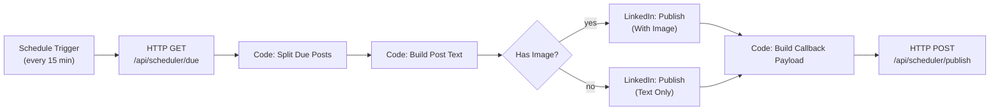

# Workflow 2: Publisher Scheduler

Runs every 15 minutes, claims due-and-approved posts from
`GET /api/scheduler/due`, publishes each to LinkedIn, and reports the
result back per-post to `POST /api/scheduler/publish`.

Import file: [`02-publisher-scheduler.json`](./02-publisher-scheduler.json)

## The one thing I couldn't fully verify

Everything in Workflow 1 was checked against real, live HTTP endpoints.
**LinkedIn's publishing API is different** — actually posting requires an
approved LinkedIn Developer app and a completed OAuth consent flow, which I
don't have credentials to set up or test from here. So instead of
hand-rolling raw HTTP calls to LinkedIn's REST API (which would require me
to guess at OAuth token refresh logic, request signing, and API version
headers with zero way to confirm any of it works), this workflow uses
**n8n's built-in LinkedIn node** — n8n owns the OAuth2 flow and keeps the
node's request shape in sync with LinkedIn's API as it changes, which is
meaningfully more reliable than a hand-built HTTP chain I can't test.

**What this means practically:** the LinkedIn node's exact parameter names
and response shape are built from the best-documented, most stable version
of that node, but you should verify two specific things after import (both
called out again in Testing Instructions):
1. That the node's fields (`text`, `shareMediaCategory`, `media`) show up
   correctly in n8n's UI, not as "unrecognized parameter" — if your n8n
   version's LinkedIn node differs, re-set the field via the dropdown/UI
   rather than trusting the raw JSON value.
2. That the field name holding the created post's ID (`Build Callback
   Payload` currently checks `item.json.id`, falling back to `postId`/`urn`)
   matches what your instance's LinkedIn node actually returns — open one
   real successful execution and check.

## Architecture

Only 9 nodes — this workflow is intentionally simpler than the Trend
Collector, since its job (process a pre-fetched list, call one API, report
back) doesn't need a fan-out/fan-in shape.

## Required credentials

| Credential name | Type | Used by | Purpose |
|---|---|---|---|
| `Scheduler Webhook Secret` | Header Auth | GET Due Posts, POST Publish Result | `x-webhook-secret` header, value = this app's `SCHEDULER_WEBHOOK_SECRET` |
| `LinkedIn account` | LinkedIn OAuth2 (n8n's built-in credential type) | Both Publish Post nodes | Actual LinkedIn posting permission |

**Setup — Scheduler Webhook Secret:** same pattern as Workflow 1 — Header
Auth credential, header name `x-webhook-secret`, value from
`linkedin-ai-studio/.env`.

**Setup — LinkedIn account (the OAuth2 credential):**
1. Create a LinkedIn Developer app at [linkedin.com/developers/apps](https://www.linkedin.com/developers/apps) (free).
2. Add the **"Share on LinkedIn"** product to the app (grants `w_member_social` scope — posting on your own behalf, no partner review needed for this scope specifically).
3. In n8n: **Credentials → New → LinkedIn OAuth2 API**. n8n will show you a redirect URL — add it to your LinkedIn app's "Authorized redirect URLs."
4. Fill in the Client ID/Secret from your LinkedIn app, click **Connect my account**, approve the consent screen once.
5. Save as `LinkedIn account`, attach it to both **Publish Post** nodes.

n8n handles token refresh automatically after this — you don't re-auth on a schedule.

## Environment variables (n8n side)

Same `APP_BASE_URL` as Workflow 1 — this workflow reuses it for both the GET and POST calls.

## Nodes

| Node | Type | Purpose |
|---|---|---|
| Every 15 Minutes | Schedule Trigger | Cron `*/15 * * * *` |
| GET Due Posts | HTTP Request | `GET {APP_BASE_URL}/api/scheduler/due?limit=20` — the app atomically claims these rows server-side, so a second overlapping run can't double-publish the same post |
| Split Due Posts | Code | Unwraps the response's `{posts: [...]}` object into one n8n item per due post |
| Build Post Text | Code | Builds the final post body: `content` as-is for SINGLE_POST/ARTICLE, or numbered slides joined together for CAROUSEL (see note below), plus hashtags appended |
| Has Image? | If | Branches on whether the draft has a completed image |
| Publish Post (With Image) / (Text Only) | LinkedIn | Actually posts to LinkedIn via n8n's OAuth2-backed node. `continueOnFail: true` — a failed post doesn't crash the run, it flows through with an `error` field instead |
| Build Callback Payload | Code | Converts either branch's output into `{scheduledPostId, success, publishedUrl}` or `{scheduledPostId, success: false, error}` — recovers `scheduledPostId` via `pairedItem` back to **Build Post Text**, since action nodes commonly replace `.json` with their own API response rather than preserving input fields |
| POST Publish Result | HTTP Request | `POST {APP_BASE_URL}/api/scheduler/publish` with that exact payload — one call per due post |

## CAROUSEL handling (a real, documented limitation)

LinkedIn's simple posting API (and n8n's LinkedIn node) supports text + a
single image, not true multi-image carousels/documents — that requires
LinkedIn's newer Posts API with a multi-step document upload, which is
meaningfully more complex and untested here. For now, a `CAROUSEL`-format
plan gets its slides joined into one text post (`1. ...`, `2. ...`), which
still publishes something coherent rather than failing outright. See
Production Recommendations for the real-carousel upgrade path.

## Testing instructions

1. **Import** `02-publisher-scheduler.json`.
2. **Attach both credentials** — Scheduler Webhook Secret on the two HTTP nodes, LinkedIn account on both Publish Post nodes.
3. **Set `APP_BASE_URL`** in n8n's environment (shared with Workflow 1).
4. **Check the LinkedIn nodes render correctly** in n8n's UI first — open each, confirm `text`, `shareMediaCategory`, and (on the image variant) `media` show as recognized fields, not raw/unparsed JSON. If any show as broken, re-pick them via the node's own UI controls.
5. **Create one test ScheduledPost** via the app itself: go through Approval (`/approval`) on a real draft and schedule it for a couple of minutes in the future, OR insert a test row directly if you want to control timing precisely.
6. **Run the workflow manually** (or wait for the schedule) once that post is due:
   - Confirm **GET Due Posts** returns your test post in its `posts` array.
   - Confirm **Split Due Posts** produces exactly 1 item.
   - Confirm **Build Post Text** produced a sensible `postText`.
   - Confirm the correct **Has Image?** branch fired based on whether your test draft has a completed image.
   - **Open the LinkedIn node's actual output** after it runs — find the field holding the created post's ID/URN, and compare it against what `Build Callback Payload` is looking for (`item.json.id`/`postId`/`urn`). Adjust that Code node if the real field name differs.
   - Confirm **POST Publish Result** returns `{"ok": true}`.
7. **Verify in the app**: `/calendar` shows the post as Published with a working "View live post" link; check LinkedIn itself to confirm the post is actually there.
8. **Test the failure path deliberately**: temporarily break the LinkedIn credential (revoke it in LinkedIn's app settings, or use an expired token) and confirm `/calendar` shows "Publish failed" with the real error message, and that the post becomes claimable again on the next poll (check `/api/scheduler/due` returns it again after ~15 min, or immediately if you re-run manually).

## Error handling

- **A failed publish for one post doesn't block others.** `continueOnFail: true` on both LinkedIn nodes means one bad post (invalid content, rate limit, revoked token) still reports its failure back individually — every other due post in the same batch still gets attempted.
- **The app-side claim naturally handles a workflow crash.** If this workflow dies mid-run after claiming posts but before calling back, those posts stay claimed for 15 minutes (`CLAIM_TIMEOUT_MINUTES` in the app's route) before becoming reclaimable — no manual intervention needed for a transient crash.
- **A failed callback POST** (app down, wrong secret) retries 3× like every other HTTP node here; if it still fails, n8n's execution history records it and that post silently stays claimed until the timeout — check n8n's Executions tab if `/calendar` seems stuck on "Awaiting publish" longer than expected.

## Retry logic

`retryOnFail: true`, `maxTries: 3`, `waitBetweenTries: 5000` on **GET Due Posts**, both **Publish Post** nodes, and **POST Publish Result** — same n8n-native mechanism used throughout these workflows.

## Production recommendations

1. **Real carousel/multi-image support.** If CAROUSEL-format posts matter enough to warrant it, replace the two LinkedIn nodes with raw HTTP Request calls to LinkedIn's versioned Posts API (`/rest/posts`) plus its Images API for multi-image upload — a real, more complex build-out, not something to guess at without live LinkedIn API access to verify against.
2. **Confirm the LinkedIn node's ID field once, then stop worrying about it.** This is the one specific thing flagged as unverified above — a single successful test run resolves it permanently.
3. **Rate-limit awareness.** LinkedIn's posting API has its own rate limits per app/day — if you ever schedule many posts close together, watch for `429`s in the LinkedIn node's error output and consider spacing `scheduledFor` times further apart rather than relying on this workflow to throttle for you (it currently doesn't).
4. **Alerting on failure** — same recommendation as Workflow 1: assign an Error Workflow so a broken LinkedIn credential (e.g. an expired/revoked token) surfaces immediately rather than silently failing every 15 minutes.
5. **Consider a dead-letter view.** If a post fails repeatedly (check `publish_attempts` on the `scheduled_posts` table), you may want a small addition to `/calendar` or `/approval` surfacing "failed N times" distinctly from "just scheduled" — not built here since it wasn't asked for, but a natural next UI touch once you see real failure patterns.
