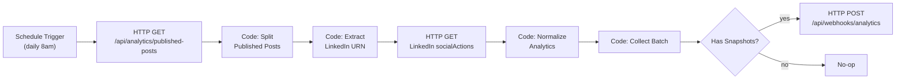

# Workflow 3: Analytics Collector

Runs daily, retrieves every published post from
`GET /api/analytics/published-posts`, pulls engagement metrics from
LinkedIn for each, and reports the results as one batch to
`POST /api/webhooks/analytics`.

Import file: [`03-analytics-collector.json`](./03-analytics-collector.json)

## Read this before relying on it: the biggest unverified piece across all 3 workflows

**LinkedIn's engagement data is genuinely restricted, not just untested.**
Two different things are true here:

1. **Likes and comments** for content you own are available through
   LinkedIn's `socialActions` API. This has existed for years and is
   normally accessible to a standard developer app with `w_member_social`
   scope — I'm fairly confident this part works, but I have no LinkedIn
   Developer app to actually call it and confirm.
2. **Impressions and share counts are not available at all** through that
   API, or through any standard developer-tier access. Real per-post
   impression/reach numbers require LinkedIn's **Marketing API Partner
   Program** — a separate, approval-gated partnership application (not
   something you get by just registering a developer app), typically aimed
   at agencies/tools with an established business relationship with
   LinkedIn, not individual/personal use.

**What this workflow actually does about it:** sends `likes` and `comments`
when the API call succeeds, and **deliberately omits `impressions` and
`shares` entirely** rather than sending fake zeros — the app's
`AnalyticsSnapshot` schema already treats every metric as optional for
exactly this reason (see `src/validation/analytics.ts`).

**If `socialActions` turns out to be blocked/deprecated for your app** when
you actually test it: this workflow's core value (tracking likes/comments
over time, feeding the Learning Agent) degrades to zero, not partial —
Production Recommendations below covers the realistic fallback options.

## Architecture



## Required credentials

| Credential name | Type | Used by | Purpose |
|---|---|---|---|
| `Analytics Webhook Secret` | Header Auth | GET Published Posts, POST Analytics to App | `x-webhook-secret` header, value = this app's `ANALYTICS_WEBHOOK_SECRET` |
| `LinkedIn account` | LinkedIn OAuth2 | GET LinkedIn Social Actions | **Reuses the exact same credential from Workflow 2** — no new LinkedIn app/consent needed |

Setup for `Analytics Webhook Secret` is the same Header Auth pattern as the other two workflows. `LinkedIn account` is already set up if you built Workflow 2 — just attach the existing credential to the **GET LinkedIn Social Actions** node here too.

## Environment variables (n8n side)

Same `APP_BASE_URL` as the other two workflows.

## Nodes

| Node | Type | Purpose |
|---|---|---|
| Daily at 8am | Schedule Trigger | Cron `0 8 * * *` |
| GET Published Posts | HTTP Request | `GET {APP_BASE_URL}/api/analytics/published-posts` — unbounded by time, since engagement keeps changing long after publish (see the app's route comment) |
| Split Published Posts | Code | Unwraps `{posts: [...]}` into one item per post |
| Extract LinkedIn URN | Code | Regex-extracts `urn:li:share:...` (or similar) out of the stored `publishedUrl`, URL-encodes it for use as a path parameter |
| GET LinkedIn Social Actions | HTTP Request | `GET api.linkedin.com/v2/socialActions/{encodedUrn}` — `continueOnFail: true`, so one post's failure (deleted, private, API hiccup) doesn't block the others |
| Normalize Analytics | Code | Builds `{scheduledPostId, capturedAt, likes, comments}` per successful post; **filters out failed posts entirely** rather than sending zeros; recovers `scheduledPostId` via `pairedItem` back to **Extract LinkedIn URN** |
| Collect Batch | Code | Gathers every normalized snapshot into one array (one POST call regardless of how many posts, rather than one call per post) |
| Has Snapshots? | If | Skips the POST if nothing succeeded this run |
| POST Analytics to App | HTTP Request | `POST {APP_BASE_URL}/api/webhooks/analytics` with the full snapshot array |
| No New Analytics | No-Op | Dead-end marker for the empty-result branch |

## Payload shape sent to the app

```json
[
  {
    "scheduledPostId": "ckv9x...",
    "capturedAt": "2026-08-02T08:00:00.000Z",
    "likes": 42,
    "comments": 7
  }
]
```

No `impressions`/`shares` keys at all when unavailable — matches
`analyticsSnapshotPayloadSchema`'s all-optional metric fields.

## Testing instructions

1. **Import** `03-analytics-collector.json`.
2. **Attach credentials**: `Analytics Webhook Secret` on both HTTP nodes to the app, `LinkedIn account` (same one from Workflow 2) on the Social Actions node.
3. **Set `APP_BASE_URL`.**
4. **Test the highest-risk node in isolation first**: after you have at least one real published post (from Workflow 2), manually execute just **GET LinkedIn Social Actions** with a real `encodedUrn`. Three possible outcomes:
   - **200 with `likesSummary`/`commentsSummary`** → matches what this workflow expects, proceed to step 5.
   - **403/401** → your app's scope doesn't include this endpoint; check LinkedIn's current developer docs for the exact permission needed, or see Production Recommendations for fallback options.
   - **404** → the URN extraction or the post itself is wrong; verify the `publishedUrl` stored in `scheduled_posts` actually contains a real, current LinkedIn URN.
5. **Run the full workflow**:
   - Confirm **Split Published Posts** produces one item per published post in your app.
   - Confirm **Extract LinkedIn URN** correctly pulls a `urn:li:...` string (not `null`) for real published posts.
   - Confirm **Normalize Analytics** output has `likes`/`comments` populated for successful calls and correctly drops any failed ones.
   - Confirm **POST Analytics to App** returns `{"inserted": N, "skipped": []}` / HTTP 201.
6. **Verify in the app**: `/analytics` shows the new snapshot with real numbers, and the engagement rate correctly shows `—` (not `0%`) since `impressions` is absent.
7. **Test the empty-result path**: temporarily point at a profile with zero published posts and confirm the workflow completes via the **No New Analytics** branch without erroring.

## Error handling

- **One post's failed Social Actions call doesn't block the batch** — `continueOnFail: true` plus explicit filtering in `Normalize Analytics` means a single 404/403 just results in one fewer snapshot this run, not a failed workflow.
- **The app rejects unknown `scheduledPostId`s individually**, not the whole batch (see `POST /api/webhooks/analytics`'s validation) — check the response's `skipped` array if `inserted` is lower than expected.
- **A systemic LinkedIn API failure** (every post's Social Actions call fails) surfaces as `Collect Batch` producing `count: 0` and the workflow taking the **No New Analytics** branch every single day — if you see zero analytics for several consecutive days, that's the signal something's actually broken (auth expired, endpoint deprecated), not "no engagement happened."

## Retry logic

`retryOnFail: true`, `maxTries: 3`, `waitBetweenTries: 5000` on all 3 HTTP nodes — same n8n-native mechanism as the other two workflows.

## Production recommendations

1. **If `socialActions` turns out to be inaccessible for your app**, realistic fallbacks in order of effort:
   - Manually check LinkedIn's own post analytics (visible to you as the post's author) and build a tiny manual-entry form in the app instead of full automation — least effort, breaks "automation" but keeps the Learning Agent fed.
   - Apply for LinkedIn's Marketing API Partner Program if you want real impressions/reach at scale — a real, multi-week approval process, not a quick fix.
   - Use a third-party social analytics tool with its own LinkedIn integration (e.g. Shield, Metricool) that already has Partner-tier access, and have this workflow call *that* tool's API instead of LinkedIn directly.
2. **Cache/skip unchanged snapshots.** Right now this runs daily regardless of whether engagement actually changed. If you want tighter history (multiple snapshots per day) or looser (skip a day if nothing changed), adjust the cron and/or add a "did anything change since the last snapshot" check before POSTing.
3. **Alerting on systemic failure** — same recommendation as the other two workflows: an Error Workflow, plus specifically watch for the "zero snapshots for N consecutive days" pattern described above, since that's this workflow's specific silent-failure mode.
4. **If you add impressions later** (via Partner access or a third-party tool), no schema change needed — `AnalyticsSnapshot.impressions` already exists and is used the moment this workflow starts sending it.
